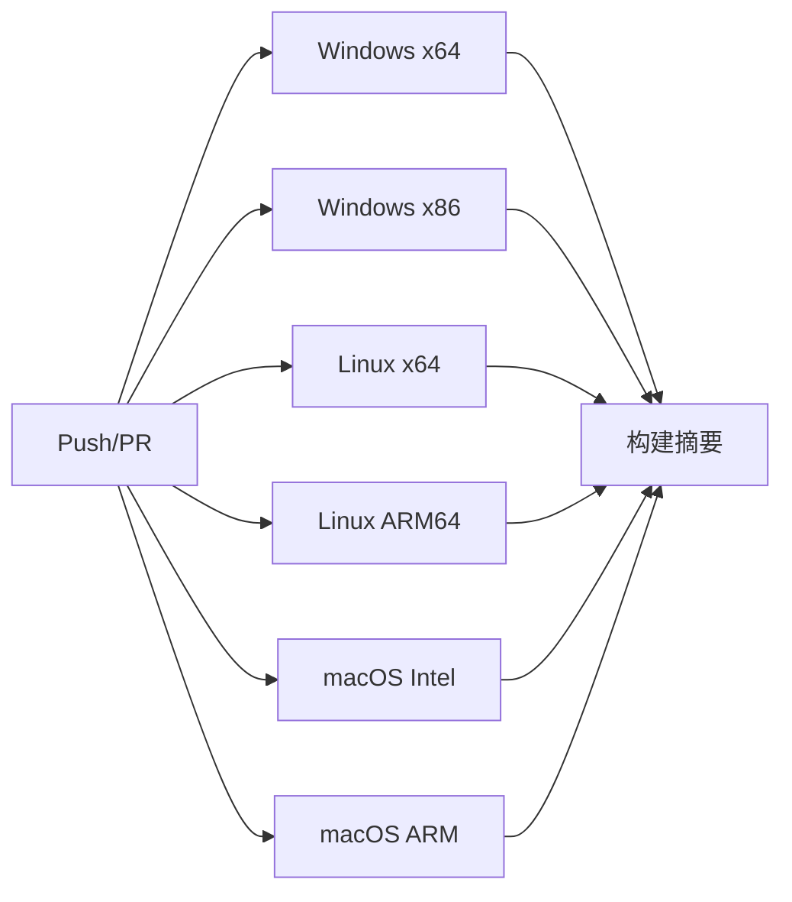
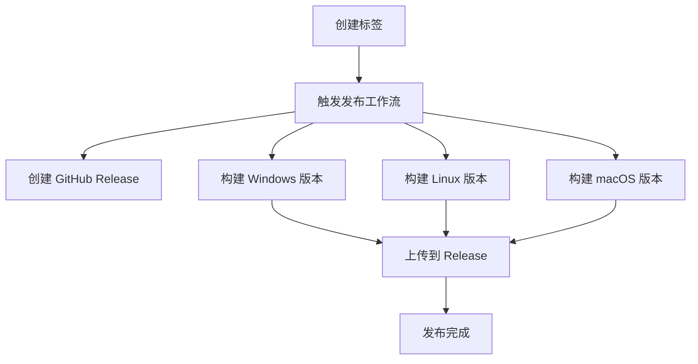

# GitHub Workflow 使用指南

本文档说明如何使用项目的 GitHub Actions 工作流来自动构建和发布多平台程序。

## 目录
1. [工作流概览](#工作流概览)
2. [自动构建工作流](#自动构建工作流)
3. [发布工作流](#发布工作流)
4. [Docker 跨平台构建](#docker-跨平台构建)
5. [代码质量检查](#代码质量检查)
6. [本地测试](#本地测试)
7. [常见问题](#常见问题)

---

## 工作流概览

项目包含以下 GitHub Actions 工作流：

| 工作流 | 文件 | 触发条件 | 用途 |
|--------|------|----------|------|
| 构建工作流 | `build.yml` | Push/PR 到主分支 | 自动构建所有平台 |
| 发布工作流 | `release.yml` | Tag 推送 | 创建正式发布 |
| Docker 构建 | `docker-cross-build.yml` | 手动触发 | Docker 多架构构建 |
| 代码质量 | `code-quality.yml` | Push/PR | 静态分析和代码检查 |

### 支持的平台和架构

✅ **Windows**
- x86_64 (64位)
- i686 (32位)

✅ **Linux**
- x86_64 (AMD64)
- aarch64 (ARM64)
- armv7 (ARM 32位，通过 Docker)

✅ **macOS**
- x86_64 (Intel)
- arm64 (Apple Silicon)

---

## 自动构建工作流

### 触发条件
- Push 到 `main`、`master` 或 `develop` 分支
- 创建 Pull Request
- 手动触发

### 构建流程



### 查看构建结果

1. 访问 GitHub 仓库的 **Actions** 标签页
2. 选择 **Build Multi-Platform** 工作流
3. 点击最近的运行查看详情
4. 在 **Artifacts** 区域下载构建产物

### 构建产物

每次构建会生成以下产物（保留 30 天）：

- `IPtools-Windows-x86_64.zip`
- `IPtools-Windows-i686.zip`
- `IPtools-Linux-x86_64.tar.gz`
- `IPtools-Linux-aarch64.tar.gz`
- `IPtools-macOS-x86_64.dmg` 或 `.tar.gz`
- `IPtools-macOS-arm64.dmg` 或 `.tar.gz`

---

## 发布工作流

### 创建新版本发布

#### 方法 1: 使用 Git 标签（推荐）

```bash
# 1. 更新 CHANGELOG.md
vim CHANGELOG.md

# 2. 提交更改
git add CHANGELOG.md
git commit -m "chore: 准备发布 v1.0.0"
git push

# 3. 创建并推送标签
git tag -a v1.0.0 -m "Release version 1.0.0"
git push origin v1.0.0
```

#### 方法 2: 手动触发

1. 访问 GitHub 仓库的 **Actions** 标签页
2. 选择 **Release Multi-Platform** 工作流
3. 点击 **Run workflow**
4. 输入版本号（例如 `v1.0.0`）
5. 点击 **Run workflow** 按钮

### 发布流程



### 发布产物

发布会自动创建：
- GitHub Release 页面
- 所有平台的二进制包
- 详细的发布说明

产物命名格式：
- `IPtools-v1.0.0-Windows-x86_64.zip`
- `IPtools-v1.0.0-Linux-x86_64.tar.gz`
- `IPtools-v1.0.0-macOS-arm64.dmg`

---

## Docker 跨平台构建

### 手动触发 Docker 构建

1. 访问 **Actions** → **Docker Cross-Platform Build**
2. 点击 **Run workflow**
3. 输入要构建的架构（例如 `amd64,arm64,armv7`）
4. 点击 **Run workflow**

### 本地 Docker 构建

```bash
# 构建单个架构
docker build -t iptools:amd64 .

# 使用 buildx 构建多架构
docker buildx build --platform linux/amd64,linux/arm64 -t iptools:latest .

# 使用提供的脚本
chmod +x scripts/test-docker-build.sh
./scripts/test-docker-build.sh all
```

### 从 Docker 容器提取二进制文件

```bash
# 创建容器
docker create --name temp iptools:amd64

# 复制二进制文件
docker cp temp:/usr/local/bin/IPtools ./IPtools-amd64

# 删除容器
docker rm temp
```

---

## 代码质量检查

### 自动检查

每次 Push 或 PR 时会自动运行：
- **CPPCheck**: C++ 静态分析
- **Clang-Tidy**: 代码规范检查
- **编译警告检查**: 检测编译警告

### 查看质量报告

1. 访问 **Actions** → **Code Quality**
2. 点击最近的运行
3. 在 **Artifacts** 下载 `code-quality-reports`
4. 查看报告文件：
   - `cppcheck-report.txt`
   - `clang-tidy-report.txt`
   - `build-warnings.txt`

### 本地运行质量检查

```bash
# 安装工具
sudo apt install cppcheck clang-tidy

# 运行检查
cppcheck --enable=all *.cpp *.h
clang-tidy *.cpp -- -I. $(pkg-config --cflags Qt5Core Qt5Gui Qt5Widgets)
```

---

## 本地测试

### 使用构建脚本

项目提供了多个便捷脚本：

**Windows:**
```batch
scripts\build-windows.bat release
```

**Linux:**
```bash
chmod +x scripts/build-linux.sh
./scripts/build-linux.sh release
```

**macOS:**
```bash
chmod +x scripts/build-macos.sh
./scripts/build-macos.sh release
```

### 创建本地发布包

```bash
chmod +x scripts/create-release.sh
./scripts/create-release.sh 1.0.0
```

### 测试 Docker 构建

```bash
chmod +x scripts/test-docker-build.sh

# 构建单个架构
./scripts/test-docker-build.sh amd64

# 构建所有架构
./scripts/test-docker-build.sh all
```

### 使用 act 本地运行 GitHub Actions

[act](https://github.com/nektos/act) 可以在本地运行 GitHub Actions：

```bash
# 安装 act
# macOS: brew install act
# Linux: https://github.com/nektos/act#installation

# 运行特定工作流
act -j build-windows
act -j build-linux

# 运行所有工作流
act push
```

---

## 常见问题

### Q1: 构建失败怎么办？

**步骤：**
1. 查看 Actions 标签页的错误日志
2. 检查是否是临时性网络问题
3. 尝试手动重新运行工作流
4. 如果持续失败，创建 Issue 并附上错误日志

### Q2: 如何修改构建配置？

编辑对应的工作流文件：
- `.github/workflows/build.yml` - 修改构建设置
- `.github/workflows/release.yml` - 修改发布设置

常见修改：
```yaml
# 修改 Qt 版本
env:
  QT_VERSION: '5.15.2'  # 改为其他版本

# 修改构建并行度
make -j4  # 改为 make -j8
```

### Q3: 为什么 ARM64 Linux 构建失败？

ARM64 交叉编译需要 ARM64 版本的 Qt 库。当前工作流中的 ARM64 构建是示例性的。

完整的 ARM64 支持需要：
1. 安装 ARM64 交叉编译工具链
2. 编译 ARM64 版本的 Qt
3. 配置交叉编译环境

或者使用 Docker 方式：
```bash
./scripts/test-docker-build.sh arm64
```

### Q4: 如何添加新的目标平台？

在 `.github/workflows/build.yml` 中添加新的 job：

```yaml
build-new-platform:
  name: Build New Platform
  runs-on: ubuntu-latest
  steps:
    - uses: actions/checkout@v4
    # 添加构建步骤
```

### Q5: 构建产物在哪里？

- **Pull Request**: Artifacts 区域（30天）
- **Tag 发布**: GitHub Releases 页面（永久）
- **本地构建**: 项目目录中的可执行文件

### Q6: 如何设置构建通知？

GitHub 会自动发送邮件通知。也可以配置：

1. 访问仓库 **Settings** → **Notifications**
2. 配置通知首选项
3. 或使用第三方集成（Slack, Discord等）

### Q7: 发布失败但标签已创建？

删除标签并重新创建：

```bash
# 删除本地标签
git tag -d v1.0.0

# 删除远程标签
git push origin :refs/tags/v1.0.0

# 修复问题后重新创建标签
git tag -a v1.0.0 -m "Release v1.0.0"
git push origin v1.0.0
```

### Q8: 如何加速构建？

1. **启用缓存**（已启用）：
   - Qt 安装缓存
   - 依赖包缓存

2. **并行构建**：
   ```yaml
   make -j$(nproc)  # Linux
   mingw32-make -j4  # Windows
   ```

3. **矩阵策略**（已使用）：
   ```yaml
   strategy:
     matrix:
       include:
         - os: windows-latest
         - os: ubuntu-latest
   ```

---

## 工作流文件说明

### build.yml
- **用途**: 自动构建和测试
- **触发**: Push/PR
- **产物**: 临时构建（30天）

### release.yml
- **用途**: 正式发布
- **触发**: Git 标签
- **产物**: GitHub Release（永久）

### docker-cross-build.yml
- **用途**: Docker 多架构构建
- **触发**: 手动
- **产物**: Docker 镜像和二进制文件

### code-quality.yml
- **用途**: 代码质量检查
- **触发**: Push/PR
- **产物**: 质量报告

---

## 最佳实践

### 1. 版本号规范

遵循 [Semantic Versioning](https://semver.org/)：
- `v1.0.0` - 主要版本
- `v1.1.0` - 次要版本（新功能）
- `v1.1.1` - 补丁版本（错误修复）

### 2. 发布前检查清单

- [ ] 更新 CHANGELOG.md
- [ ] 测试所有平台
- [ ] 更新文档
- [ ] 确保 CI 全部通过
- [ ] 代码审查完成

### 3. 提交信息规范

使用 [Conventional Commits](https://www.conventionalcommits.org/)：
```
feat: 添加新功能
fix: 修复错误
docs: 文档更新
chore: 构建工具更新
```

### 4. 分支管理

- `main/master`: 稳定版本
- `develop`: 开发版本
- `feature/*`: 功能开发
- `hotfix/*`: 紧急修复

---

## 获取帮助

- **文档**: [README.md](README.md)、[BUILD.md](BUILD.md)、[CONTRIBUTING.md](CONTRIBUTING.md)
- **Issues**: [GitHub Issues](https://github.com/YOUR_USERNAME/IPtools/issues)
- **Discussions**: [GitHub Discussions](https://github.com/YOUR_USERNAME/IPtools/discussions)

---

## 相关链接

- [GitHub Actions 文档](https://docs.github.com/en/actions)
- [Qt 跨平台编译](https://doc.qt.io/qt-5/supported-platforms.html)
- [Docker Buildx](https://docs.docker.com/buildx/working-with-buildx/)
- [Semantic Versioning](https://semver.org/)

---

**最后更新**: 2025-11-02

